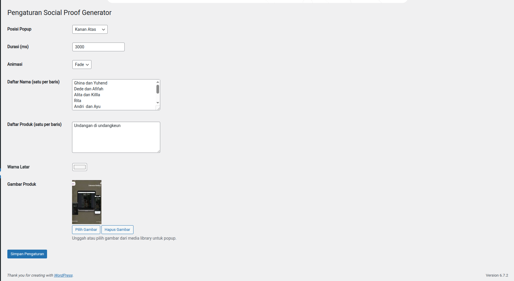

# Social Proof Generator

A WordPress plugin to display customizable social proof notifications on pages, boosting visitor trust with random names, products, and purchase times.

 <!-- Ganti dengan banner asli jika ada -->

## Description

Social Proof Generator is a lightweight WordPress plugin that displays popup notifications to showcase recent purchases or interactions on your website's pages (not posts). It allows you to customize the position, duration, animation, background color, and content of the notifications, making it perfect for e-commerce, marketing, or service-based websites.

### Features
- **Customizable Position**: Choose from bottom-left, bottom-right, top-left, or top-right.
- **Animation Options**: Fade or slide effects for smooth transitions.
- **Randomized Messages**: Display random names and products for dynamic notifications.
- **Custom Styling**: Set background color and product image URL.
- **Page-Specific**: Notifications appear only on WordPress pages, not posts.
- **Easy Setup**: Configure everything from the WordPress admin panel.

## Installation

1. Download the plugin from this repository.
2. Upload the `social-proof-generator` folder to your `/wp-content/plugins/` directory.
3. Activate the plugin through the 'Plugins' menu in WordPress.
4. Navigate to **Social Proof** in the admin menu to configure settings.
5. Save your settings, and the notifications will appear on your pages.

Alternatively, you can install it directly from the WordPress Plugin Repository (coming soon!).

## Usage

1. Go to **Social Proof** in your WordPress admin dashboard.
2. Configure the following:
   - **Popup Position**: Where the notification appears on the screen.
   - **Duration**: How long each notification is displayed (in milliseconds).
   - **Animation**: Choose between fade or slide.
   - **Names**: Enter a list of names (one per line) for random selection.
   - **Products**: Enter a list of products or services (one per line).
   - **Background Color**: Pick a color for the popup background.
   - **Product Image URL**: Provide a URL for the product image.
3. Click **Save Settings**, and the popup will automatically appear on your pages.

## Screenshots

1. **Admin Settings Page**  
    <!-- Ganti dengan screenshot asli -->

2. **Popup Example on Page**  
    <!-- Ganti dengan screenshot asli -->

## Contributing

Contributions are welcome! If you'd like to contribute to the development of Social Proof Generator, please follow these steps:

1. Fork this repository.
2. Create a new branch (`git checkout -b feature/your-feature`).
3. Make your changes and commit (`git commit -m "Add your feature"`).
4. Push to your branch (`git push origin feature/your-feature`).
5. Open a Pull Request.

Please ensure your code follows the [WordPress Coding Standards](https://developer.wordpress.org/coding-standards/wordpress-coding-standards/).

## License

This plugin is licensed under the [GPLv2 or later](https://www.gnu.org/licenses/gpl-2.0.html).

## Roadmap

- Add support for custom time formats.
- Enable notifications on specific pages via shortcode.
- Add analytics to track popup impressions.
- Support for multiple languages with translation files.

## Contact

For questions, suggestions, or support, please open an issue in this repository or contact me at [your-email@example.com](mailto:your-email@example.com).

---

*Built with ❤️ by [Muhamad Dendi Purwanto](https://github.com/MDendiPurwanto)*